Время выполнения filter.py: 

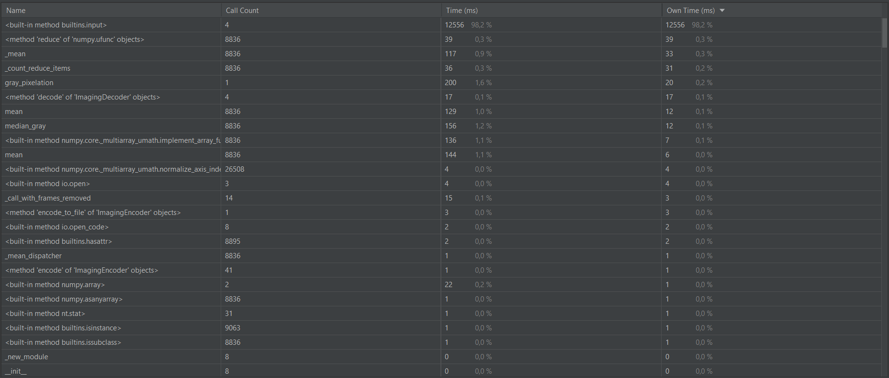 

Время выполнения old_filter.py: 

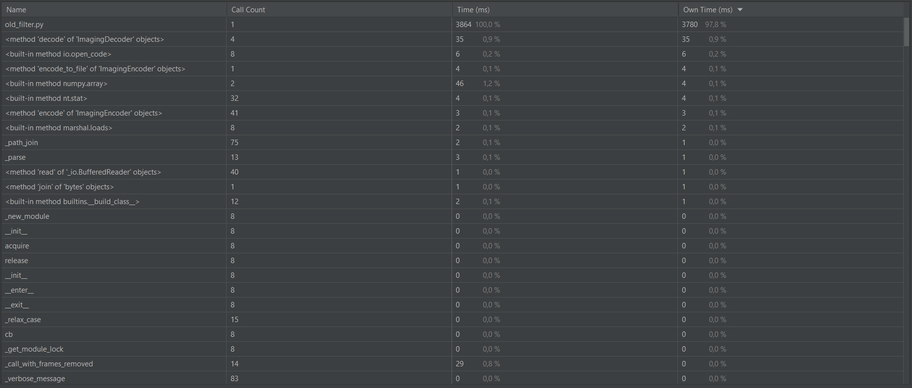 

Согласно этим результатам, filter.py выполнялся дольше old_filter.py. Это можно объяснить тем, что 98.2% времени выполнения filter.py было затрачено на ввод данных.

Время выполнения filter_with_filename.py:

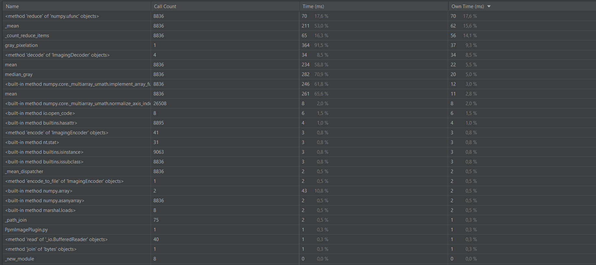 

Благодаря исключению input, время выполнения filter_with_filename.py сократилось значительно относительно filter.py. Также filter_with_filename.py эффективней old_filter.py благодаря оптимизациям (в первую очередь, матричным преобразованиям). 

Благодаря исключению input, время выполнения filter_with_filename.py сократилось значительно относительно filter.py. Также filter_with_filename.py эффективней old_filter.py благодаря оптимизациям (в первую очередь, матричным преобразованиям). 

---

Изображения:

Исходное:

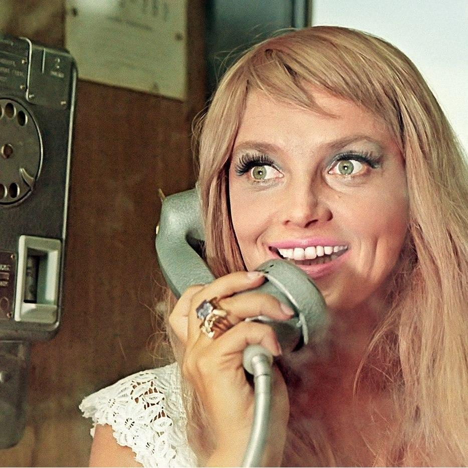 

Результат работы old_filter.py:

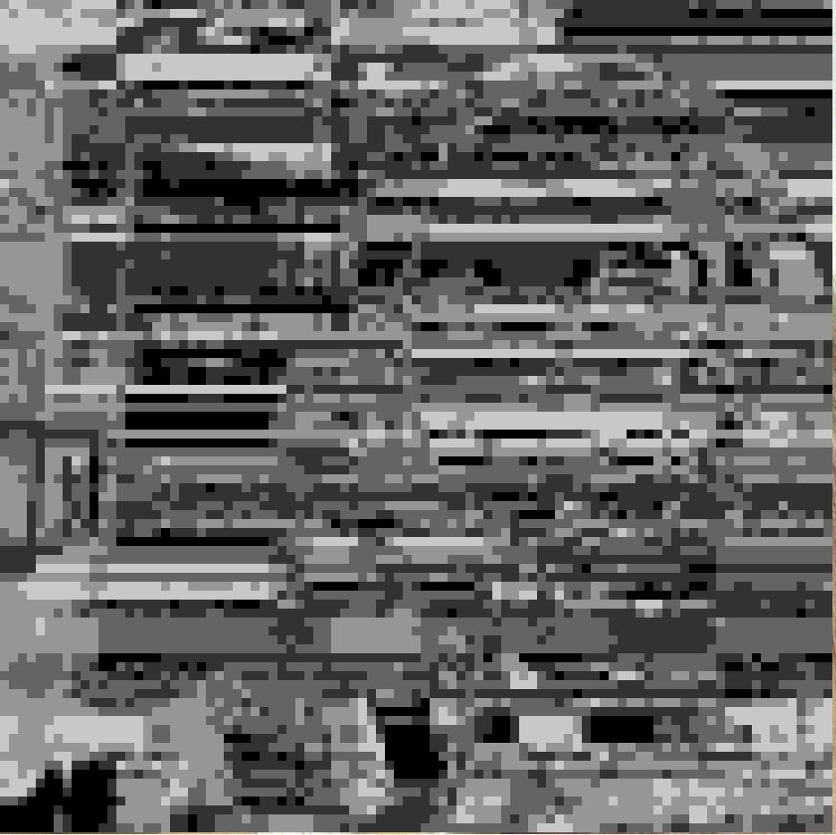 

Результат работы filter.py:

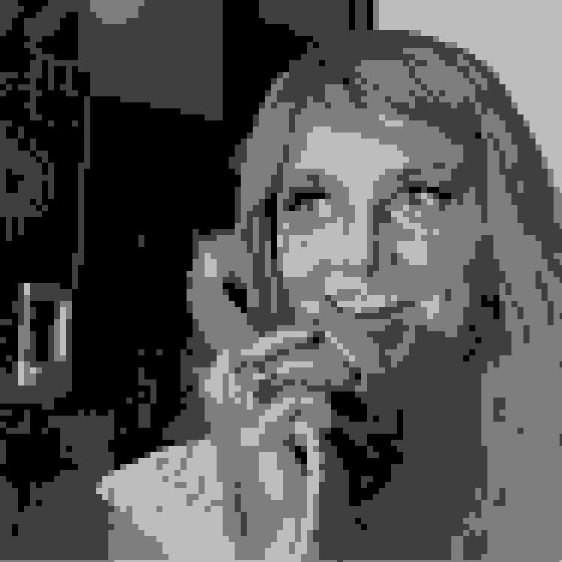

---

Исполнение доктестов для median_gray():

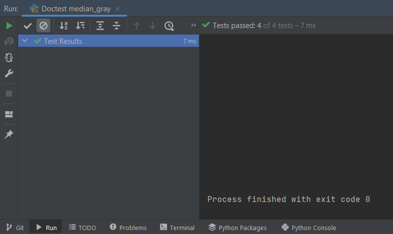 

Все тесты пройдены. Написание тестов на gray_pixelation() слишком тяжело, так как возвращаемое значение - изображение.

---

Результат инспектирования:

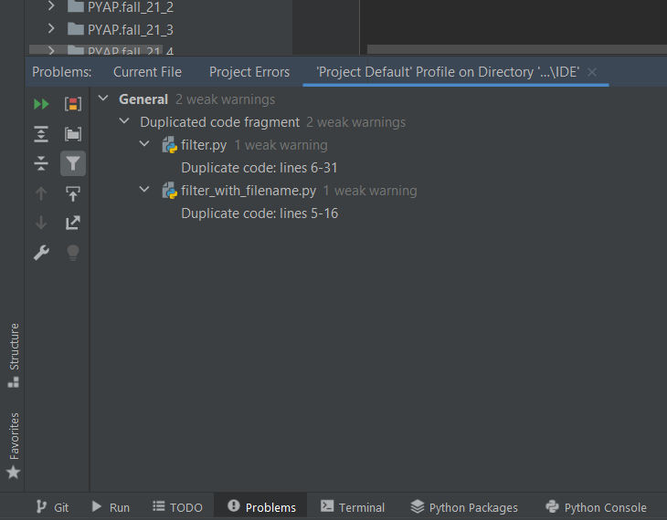 

Замечаний к коду нет, помимо дублирования кода в filter.py и filter_with_filename.py (обусловлено прошлыми заданиями).

---

Работа с отладчиком.

Тип изображения (JPEG, выделено):

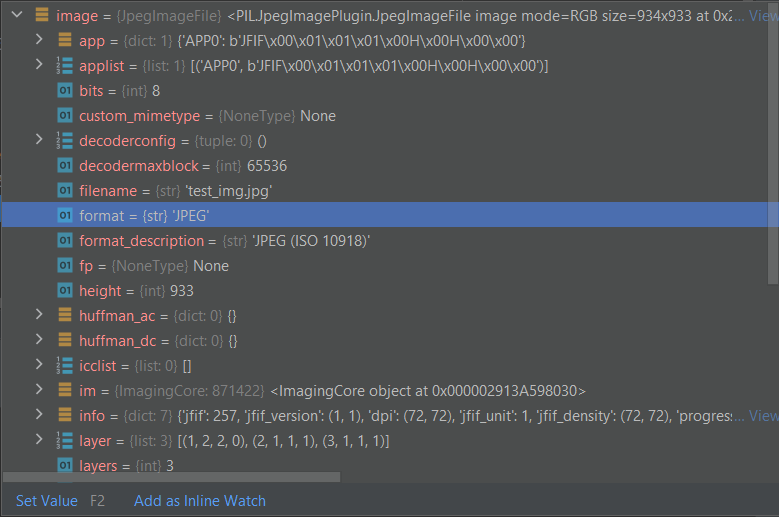 

Высота изображения (933, выделено):

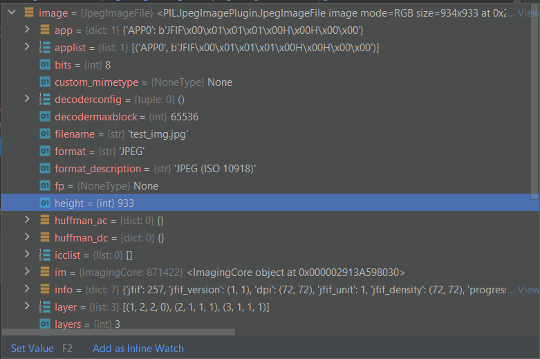 

Ширина изображения (934, выделено):

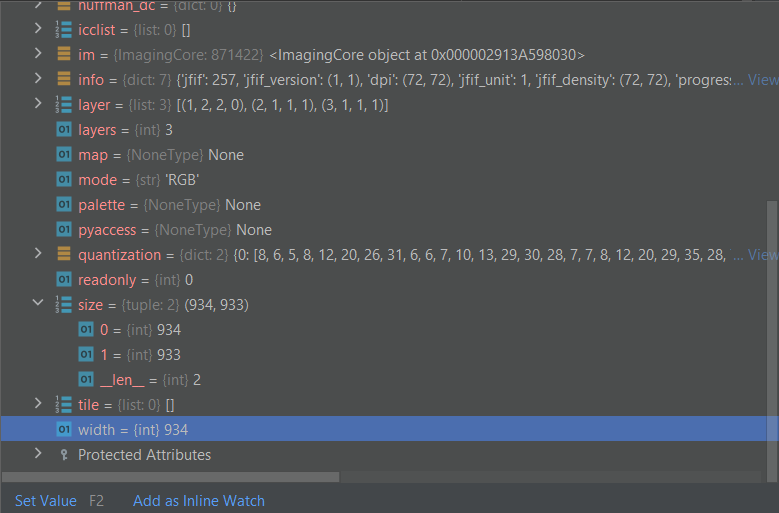 

Размер блока (10):

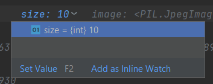 

Число градаций серого (5):

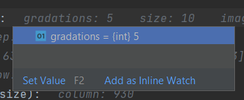 